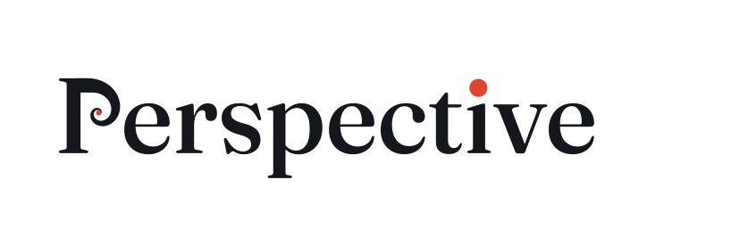

<p align="center">
  <picture>
    <source media="(prefers-color-scheme: dark)" srcset="branding/perspective-logo-white.svg">
    
  </picture>
</p>

# Perspective

**Find the well-composed photographs in your Apple Photos library and gather them into a study album.**

If you're learning composition from books like Michael Freeman's *The Photographer's Eye* or
Richard Garvey-Williams' *Mastering Composition*, your own pictures make the best worked
examples. Finding them by hand in a library of tens of thousands is impractical. Perspective
does the legwork:

1. **Ranks** your photos using the aesthetic scores Photos already computes for every image:
   perspective, symmetry, pattern, composition, framing and camera tilt.
2. **Fetches** full-quality originals for any shortlisted photos stored only in iCloud.
3. **Lays the shortlist out on numbered contact sheets**, upright and with favourites marked,
   so you (or an assistant) can review it like a light table.
4. **Checks** your picks for near-duplicates already in the album, and flags photos that look
   like someone else's (forwarded through WhatsApp or Messages, no camera data).
5. **Adds** the keepers to an album, by default called *Perspective*.

It also includes `perspective lowres`, which replaces low-resolution copies in any album
(thumbnails exported for a photo frame, say) with the full-size originals in your library.

Everything except `fetch`, `add` and `lowres --go` is read-only. Perspective never deletes
photos, and never deletes albums.

## Requirements

- macOS with the Photos app and a local Photos library
- Python 3.10+
- [osxphotos](https://github.com/RhetTbull/osxphotos) and Pillow (installed automatically)
- **Full Disk Access** for whichever app runs the command (Terminal, iTerm, your IDE…), so
  osxphotos can read the library database. See *Troubleshooting* if it still can't.
- Permission for that app to control Photos (macOS asks the first time an album is written).

```bash
git clone https://github.com/captaincomplex/perspective
cd perspective
pip install -e .
```

## Finding photos for the album

```bash
# 1. Rank everything taken since a date (or use --favourites-only, --until, --exclude-date)
perspective scan --since 2026-08-10

# 2. Pull down full-quality originals for the shortlisted photos stored only in iCloud
perspective fetch

# 3. Contact sheets: 36 per sheet, labelled P000, P001…  (* favourite, ? probably not yours)
perspective sheets            # → work/sheets/sheet_00.jpg …

# 4. Take a bigger look at the ones you like, and check them against the album
perspective verify P002 P038 P143
perspective check  P002 P038 P143

# 5. Add them
perspective add P002 P038 P143 --dry-run
perspective add P002 P038 P143
```

`scan` reviews the top 180 photos plus every favourite by default (`--top`,
`--no-include-favourites`). The working files go in `./work`; change that with
`perspective --work DIR <command>`.

### How the ranking works

Photos scores every image on dozens of aesthetic dimensions. Perspective combines the ones
that track composition, with perspective counting double:

| Score | Weight |
|---|---|
| pleasant_perspective | 2.0 |
| pleasant_symmetry, pleasant_pattern, pleasant_composition | 1.5 each |
| well_framed_subject | 1.0 |
| pleasant_camera_tilt, interesting_subject, overall | 0.5 each |

It's a triage tool, not a judge. In practice the top couple of hundred photos from a month of
shooting hold nearly everything worth looking at, and the eye on the contact sheets makes the
final call. Before adding anything, confirm your picks with `verify`: small thumbnails are
good for triage and unreliable for final decisions.

## Swapping low-res copies for originals

```bash
perspective lowres --album "Photo Frame"            # dry run: match, then write pair sheets
#   → work/lowres/pairs_00.jpg …  check every pair by eye
perspective lowres --album "Photo Frame" --go --reject L007
```

For each low-res item, the original is found by filename, by a library UUID embedded in the
filename, by the camera and capture time in the small copy's EXIF, or (with `--deep`) by a
whole-library content search for letterboxed copies. Matching is crop-aware, because small
copies are often square, subject-aware crops, and it penalises colour-versus-black-and-white
mismatches.

The match is then upgraded to the largest copy of **exactly the same frame**: same camera,
same timestamp to 50 ms. So a web export becomes the full-size original, but a burst
neighbour shot 0.2 s later never qualifies. An edited version is never swapped for an
unedited one.

Photos' AppleScript can't remove items from an album, so `--go` renames the existing album to
`<name> (old low-res)` and builds a fresh one. Nothing is deleted. Two things to check
afterwards: the new album's sort order (set it in Photos if you relied on date sorting), and
anything that referred to the old album by its internal ID rather than its name.

## Troubleshooting

**"Operation not permitted" reading the library.** Full Disk Access must be granted to the
*responsible* process, which isn't always the app you think. If the command is spawned by
another app's embedded helper, macOS may attribute it to that helper's own bundle; grant
Full Disk Access to that bundle too, and quit and reopen the app. To test access properly,
use `head -c 16 ~/Pictures/"Photos Library.photoslibrary"/database/Photos.sqlite`. `ls` will
appear to work even without access.

**Photos stops answering (AppleEvent timed out, -1712).** Look for something hammering the
disk. A running Time Machine backup (`tmutil status`) can leave Photos stuck in I/O wait,
and so can photo analysis after a restart. Perspective never asks Photos to enumerate the
whole library over AppleScript; doing that on a large library wedges Photos until it restarts.

**`fetch` fails with "could not get authorization".** That's the PhotoKit route, which needs
the separate *Photos* privacy permission. Perspective uses the AppleScript download route
instead, which needs no extra permission.

## Logo

The P's bowl is a true golden spiral (each quarter turn ×1.618) ending in a red dot, and the dot on the *i* sits on a rule-of-thirds point. Lettering is Fraunces (SIL Open Font License), outlined, so the files need no font installed. Files are in [`branding/`](branding).

## Licence

MIT — see [LICENSE](LICENSE).
